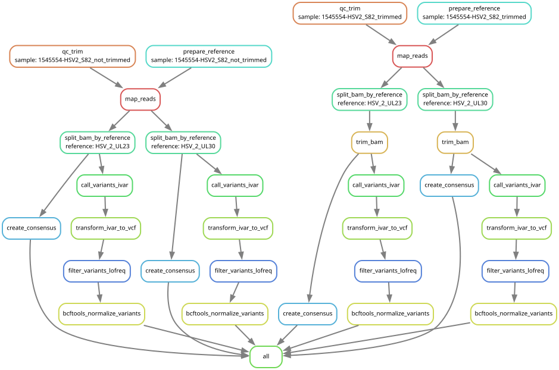

# Snakemake version of the Galaxy workflow

This repository is under active development and will evenutally provide a Snakemake port of a previously used Galaxy workflow of the Clincal Virus Genomics research group within the Institute of Virology in Freiburg im Breisgau. The main aim of the workflow is to provide a simple workflow for creating consensus genomes and variant vcf files from amplicon based NGS data of viruses. Given a sample sheet providing the paths to the NGS data and reference data used for read mapping, the workflow provides the mapping as bam file, the derived consensus genome as fasta and the variant file in vcf format. Additonally a visualization of the alignment is shown using [BAMdash](https://github.com/jonas-fuchs/BAMdash).

## Current pipeline behavior

The active workflow performs these steps (from preprocessing through variant analysis to final BAMDash report generation):

| Step | Rule | Main tools |
|---|---|---|
| Parse sample sheet, FASTA headers, optional BED targets | Python helpers in `Snakefile` | pandas, Biopython |
| Create masked reference if BED is present | `mask_reference` | custom `scripts/mask_refs.py` |
| Copy unmasked reference if no BED is present | `copy_reference` | coreutils |
| Build BWA/SAMtools indices | `prepare_reference` | bwa, samtools |
| QC + adapter/quality trimming | `qc_trim` | fastp |
| Map reads and create filtered BAM | `map_reads` | bwa mem, samtools |
| Split BAM by reference ID | `split_bam_by_reference` | samtools |
| Primer trimming on split BAM (only when BED is provided) | `trim_bam` | ivar |
| Build consensus sequence per reference | `create_consensus` | samtools, ivar |
| Call variants per reference | `call_variants_ivar` | samtools, ivar |
| Convert iVar TSV to VCF | `transform_ivar_to_vcf` | `external_scripts/ivar_variants_to_vcf.py` |
| Filter variants | `filter_variants_lofreq` | lofreq |
| Normalize variants | `bcftools_normalize_variants` | bcftools, bgzip |
| Generate BAM visualization HTML | `visualize_bam_bamdash` | bamdash |


## Sample sheet 

Required columns:

| Column | Meaning |
|---|---|
| `sample` | Sample identifier (must be unique) |
| `reference_fasta` | Path to FASTA file |
| `r1` | Path to read 1 FASTQ(.gz) |
| `r2` | Path to read 2 FASTQ(.gz) |

Optional column:

| Column | Meaning |
|---|---|
| `bed` | Primer BED file; enables masking + `trim_bam` branch |

Validation performed by the workflow:

1. Duplicate sample names are rejected
2. FASTA record IDs must be unique and non-empty
3. If BED is present, BED reference names must be a subset of FASTA IDs
4. Effective references per sample are BED reference names (if BED exists) or FASTA record IDs

Example format (dummy paths):

| sample | reference_fasta | bed | r1 | r2 |
|---|---|---|---|---|
| sample_trimmed | /data/refs/hsv2_multi.fasta | /data/beds/hsv2_primers.bed | /data/fastqs/sample_R1.fastq.gz | /data/fastqs/sample_R2.fastq.gz |
| sample_untrimmed | /data/refs/hsv2_multi.fasta | | /data/fastqs/sample_R1.fastq.gz | /data/fastqs/sample_R2.fastq.gz |

## Output layout

All outputs are written under `res_dir` from `config.yaml`.

```
<res_dir>/
  references/
    <reference_hash>/
      <reference_hash>.masked.fasta or <reference_hash>.unmasked.fasta
      *.fai *.amb *.ann *.bwt *.pac *.sa
  <sample>/
    qc/
    mapping/
    consensus/
    variants/
    visualization/
```

Logs are written under `logs/` in the repository root.

## Configuration

The parameters are provided via the `params.yaml/` file. Sensible default values are provided there for each parameter. 


## Environments and containers

Rule-level environments currently referenced by the Snakefile:

| File | Used for |
|---|---|
| `requirements/requirements_aln.yaml` | bwa, samtools, ivar |
| `requirements/requirements_mask_refs.yaml` | reference masking script |
| `requirements/requirements_fastp.yaml` | fastp |
| `requirements/requirements_lofreq.yaml` | lofreq filtering |
| `requirements/requirements_bcftools.yaml` | bcftools normalization (+ bgzip via bcftools/htslib) |
| `requirements/requirements_bamdash.yaml` | BAMDash visualization |

The `transform_ivar_to_vcf` step uses the container image defined in the Snakefile.

## Running the workflow

```bash
# Dry run
snakemake -n -p

# Typical run (internal infrastructure)
# Replace <data_dir> with your mounted data root used by config/sample sheet paths.
snakemake --cores 60 --use-conda --verbose --conda-frontend conda \
   --use-singularity --singularity-args "--bind <data_dir>:<data_dir>"
```

If your Singularity runtime does not support implicit mounts, keep the explicit `--singularity-args --bind` mapping.

## DAG

Generate and render the DAG:

```bash
snakemake --dag | dot -Tsvg > dag.svg
```

The current `dag.svg` corresponds to an example run where one dataset is represented twice in the sample sheet (trimmed and untrimmed branch) and mapped against two HSV2 reference IDs (UL23 and UL30), demonstrating reference fan-out, conditional primer trimming, and the visualization branch that produces BAMDash HTML reports for each sample/reference pair.




## Hashing of references and bed files

A single run can use several reference databases for mapping.
In practice, many samples usually refere to the same reference for mapping, so rebuilding indexes for every sample would be inefficient.

To avoid this, the workflow creates a content hash, to only build a database once per reference:

- If no BED file is provided, the hash is computed from the FASTA file only.
- If a BED file is provided, the hash is computed from FASTA + BED together.

Including the BED file is important because primer trimming changes the effective reference used for mapping.
So the same FASTA with a different BED must produce a different hash and a different cached database.

During sample-sheet loading, the workflow builds a dictionary that maps each sample's `(reference_fasta, bed)` combination to its hash.
That hash is then used as the key for reusing or creating the corresponding reference database artifacts.